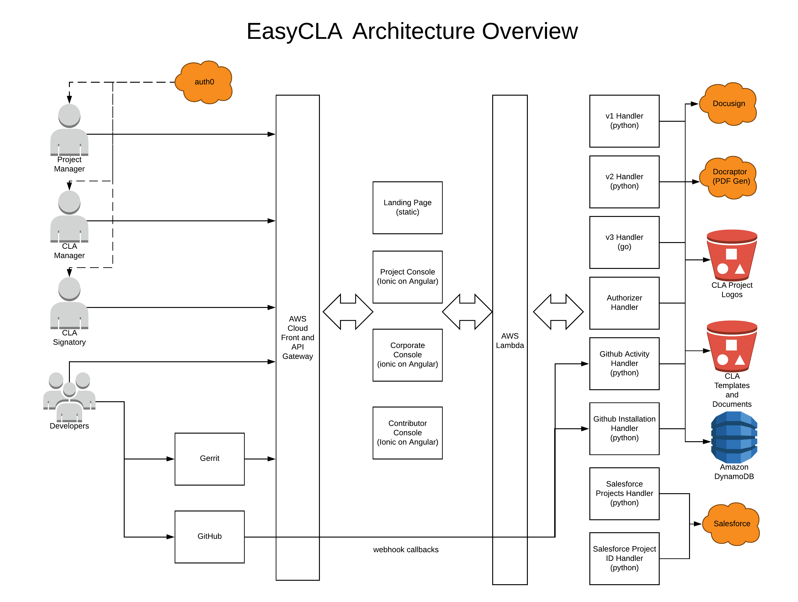

# Introduction to EasyCLA

The Contributor License Agreement \(CLA\) service of the Linux Foundation lets project contributors read, sign, and submit contributor license agreements easily.

This repository contains both the backend and front-end UI for supporting and managing the application.

This platform supports both GitHub and Gerrit source code repositories. Additional information can be found in the [EasyCLA documentation](https://docs.linuxfoundation.org/lfx/easycla).

## Announcements

- 06/10/2020 - We have replaced code references from whitelist to Approved List.  This includes package names, code comments, swagger specifications, API endpoints, variable names, and UI components.

## Third-party Services

[EasyCLA](#easycla-architecture)

The EasyCL system leverages the following third party services:

* [Docusign](https://www.docusign.com/) for CLA agreement e-sign flow
* [Docraptor](https://docraptor.com/) for converting CLA templates into PDF files
* [GitHub](https://github.com/) for GitHub PR CLA authorization checking/gating
* Gerrit for CLA authorization review checking/gating
* Auth0 For Single Sign On
* Salesforce via the LFX Platform APIs.

## CLA Backend

The CLA project has two backend components:

* Python - some older APIs are implemented in python and can be found in the [cla-backend](cla-backend) directory.
* GoLang - Most of the backend development is implemented in Golang, and can be found in the
  [cla-backend-go](cla-backend-go) directory. In particular, this backend contains APIs powering most of the v2 APIs
  which integrate with the LFX Platform (including Salesforce data), and the LFX platform permissions model.

## CLA Frontend

For EasyCLA version 2, all three consoles are hosted in separate repositories.

* [Project Control Center](https://projectadmin.lfx.linuxfoundation.org/) contains all the old v1 Project Console
  capabilities plus many new features. This new console includes not only the EasyCLA components, but also the project
  related features for LF ITX and other LFX Platform projects.
* [Corporate Console](https://organization.lfx.linuxfoundation.org/company/dashboard) contains the old v1 Company Console
  capabilities. This new console includes not only the EasyCLA components, but also the company related features for LF
  ITX and other LFX Platform projects.
* [Contributor Console](https://github.com/linuxfoundation/easycla-contributor-console) contains the old v1 Contributor Console
  capabilities with new features that integrate with the LFX Platform (including the Salesforce data).

For EasyCLA version 1, the consoles are:

* [cla-frontend-project-console](cla-frontend-project-console) for the LinuxFoundation director/admin/user to manage project CLA
* [cla-frontend-corporate-console](cla-frontend-corporate-console) for any concrete company CCLA manager to sign a CCLA and manage employee CLA approved list
* [cla-frontend-contributor-console](cla-frontend-contributor-console) for any project contributor to sign ICLA or CCLA

These CLA frontend components of three independent SPA built with [Ionic](https://ionicframework.com/) framework.

## EasyCLA Architecture

The following diagram explains the EasyCLA architecture.

## EasyCLA Release Process

The following diagram illustrates the EasyCLA release process:

## License

Copyright The Linux Foundation and each contributor to CommunityBridge.

This project’s source code is licensed under the MIT License. A copy of the license is available in LICENSE.

This project’s documentation is licensed under the Creative Commons Attribution 4.0 International License \(CC-BY-4.0\). A copy of the license is available in LICENSE-docs.

