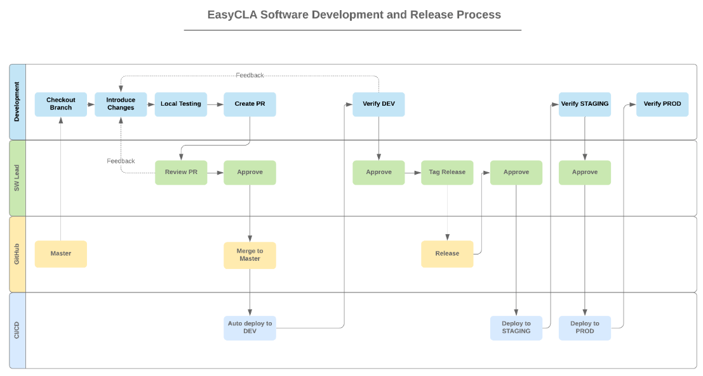

# Introduction to EasyCLA

The Contributor License Agreement \(CLA\) service of the Linux Foundation lets project contributors read, sign, and submit contributor license agreements easily.

This repository contains both the backend and front-end UI for supporting and managing the application.

This platform supports both GitHub and Gerrit source code repositories. Additional information can be found in the [Getting Started Guide](getting-started/).

## Announcements

- 06/10/2020 - We will be replacing code references from whitelist to Approval
  List in the coming sprints.  This includes package names, code comments,
  swagger specifications, API endpoints, variable names and UI components.

## Third-party Services

[EasyCLA](./#easycla-architechture)

Besides integration with Auth0 and Salesforce, the CLA system has the following third party services:

* [Docusign](https://www.docusign.com/) for CLA agreement e-sign flow
* [Docraptor](https://docraptor.com/) for convert html CLA template as PDF file

## CLA Backend

The CLA project has two backend projects.

The majority of the backend APIs are implemented in python, and can be found in the `cla-backend` directory.

Recent backend development was implemented in Golang, and can be found in the
`cla-backend-go` directory. In particular, this backend contains APIs powering
Automated Templates, GitHub Approval Lists, and Duplicate Company handling in the
Corporate Console.

## CLA Frontend

### Overview

CLA frontend consists of three independent SPA build with [Ionic](https://ionicframework.com/) framework.

* `cla-frontend-project-console` for LinuxFoundation director/admin/user to manage project CLA
* `cla-frontend-corporate-console` for any concrete company CCLA manager to sign a CCLA and manage employee CLA approved list
* `cla-frontend-contributor-console` for any project contributor to sign ICLA or CCLA

## EasyCLA Architechture

The following diagram explains the EasyCLA architecture.

## EasyCLA Release Process

The following diagram illustrates the EasyCLA release process:

## License

Copyright The Linux Foundation and each contributor to CommunityBridge.

This project’s source code is licensed under the MIT License. A copy of the license is available in LICENSE.

The project includes source code from keycloak, which is licensed under the Apache License, version 2.0 \(Apache-2.0\), a copy of which is available in LICENSE-keycloak.

This project’s documentation is licensed under the Creative Commons Attribution 4.0 International License \(CC-BY-4.0\). A copy of the license is available in LICENSE-docs.

