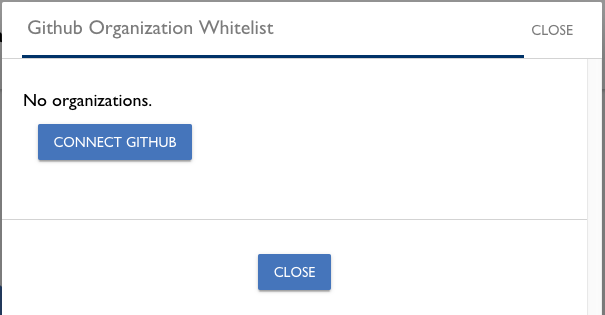

# Approved List Contributors

Whitelists are lists of domain names, email addresses of individuals, GitHub usernames, or GitHub organization names who are authorized to contribute under a signed Corporate CLA. As a CCLA manager, you allow contributions to projects on behalf of your company by using any Approved List:

* Domain Approved List allows entities to contribute under any email address under that domain name.
* Email Approved List allows entities to contribute under an individual email address.
* GitHub Approved List allows entities to contribute under a GitHub username.
* GitHub Organization Approved List allows entities to contribute under a GitHub organization name.

Each Approved List applies to the project for which the company has signed a Corporate CLA. The CLA application checks all the whitelists for allowing contributions to a company project. A contributor only needs to be on one Approved List. Contributors can use EasyCLA to send email requests to be associated \(whitelisted\) with the company.

_Multiple CCLA managers cannot Approved List the same domain and sign a CCLA for the same company._

**Do these steps:**

1. [Sign in](sign-in-to-the-cla-corporate-console.md).

   The CLA Corporate Console appears and shows Companies.

2. Click a **company** of interest.

   The CLA Corporate Console appears and shows Signed CLAs.

   

3. Click a **CLA**.

   The whitelists appear:

   

4. Decide which Approved List you want to edit:
   * [Domain Approved List, Email Approved List, or GitHub Approved List](whitelist-contributors.md#domain-whitelist--email-whitelist--or-github-whitelist)
   * [GitHub Organization Approved List](whitelist-contributors.md#github-organization-whitelist)

## Domain Approved List, Email Approved List, or GitHub Approved List

The corresponding Edit _domain/email/github_ Approved List dialog lets you add, edit, and delete values to a Approved List so that employees \(developers\) can be associated to the company. An example domain name value is joesbikes.com. A wildcard whitelists the domain and all subdomains, for example: \*.joesbikes.com or \*joesbikes.com would Approved List joes.bikes.com, shop.joesbikes.com, and blog.joesbikes.com.

**Note:** To remove an entry from the Approved List, click **X** next to the item, and click **SAVE**.

1. Click the **pencil** icon next to the Approved List that you want to edit:
2. Click **ADD DOMAIN/EMAIL/GITHUB**, enter a **domain name**, **email address**, or **GitHub username** for the employees for whom you want to Approved List, respectively, and click **SAVE**. For example:

Your entries appear in their corresponding whitelists.

Your entries appear in their corresponding whitelists.

### GitHub Approved List

## GitHub Organization Approved List

The GitHub Organization Approved List lets you add or remove organizations from a Approved List so that company employees can contribute to project—the CLA service checks the GitHub organizations that the user belongs to.

_**Requirements:**_

Each member of your organization must ensure that these items are Public in their GitHub Profile:

* Their membership with the organization. Each Private member should follow this [procedure](https://help.github.com/en/articles/publicizing-or-hiding-organization-membership) to make their membership Public.
* The associated email address for the organization member. Each Private member should make their associated email address Public \(members can have multiple emails in their Profile, so they must select the appropriate one\).

**Do these steps:**

1. Click the **pencil** icon next to Github Org Approved List.

   The Github Organization Approved List dialog appears.

   

   **Note:** Click **CONNECT GITHUB** if the organization you want to Approved List is not listed in the dialog. The Add GitHub Organization dialog appears and lets you specify the GitHub organization.

2. Click **ADD** or **REMOVE** next to the organization that you want to add or remove, respectively.

   Your organizations appear in their organization Approved List.

