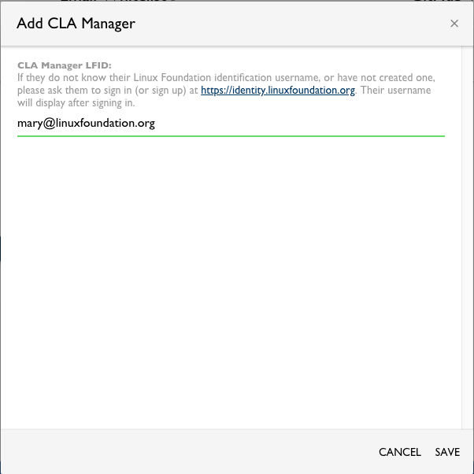

# Add or Delete CLA Managers
CLA managers have the following responsibilities:

* Add a company to a project.

* Whitelist domain names and email addresses.

* Change the settings to manage your company CLAs.

You can add CLA managers to your project or remove them.

**Do these steps**:

1. Sign in.

   The CLA Corporate Console appears and shows Companies.

2. Click a **company** of interest.

   The CLA Corporate Console shows Signed CLAs.

   

3. Click a **CLA**.

   Project Signatures lists the signed the CLA Managers and Employee Acknowledgements for the project.

4. Do an action:

   * Add a CLA Manager - Go to the following section.

   * Delete a CLA Manager - Go to the corresponding section below.

### Add a CLA Manager

1. Click the **plus sign** (+) in the CLA Managers pane.

   The Add CLA Manager dialog appears.

   

2. Enter the Linux Foundation identification of the CLA manager who you want to add, and click ****SAVE****.

   

The CLA manager is listed under CLA Managers.

### Delete a CLA Manager

1. Click **Delete** next to a CLA manager to remove that person as a signatory.

2. Click **DELETE** on the Delete Manager confirmation dialog.

The CLA manager is removed from under CLA Managers.