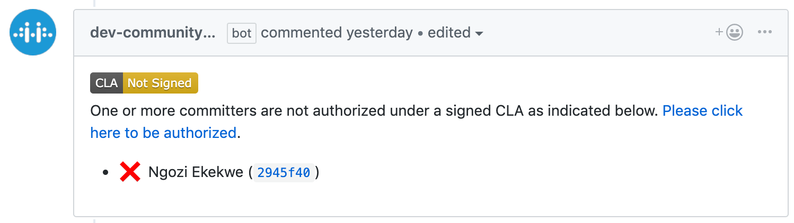
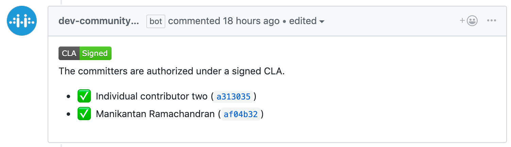
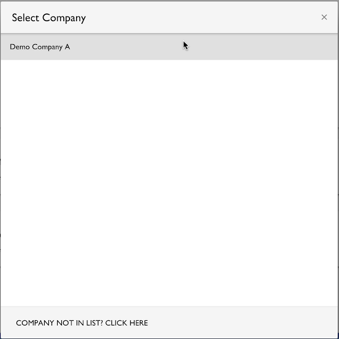

# Contribute to a GitHub Company Project
As a corporate (employee) contributor to an open-source project, you create a pull request in GitHub to inform code maintainers about changes made to the code. If any of your contributions to the project are created as part of your employment, the work may not belong to you—it may be owned by your employer. In that case, the CLA signatory represents the employer (company) for legal reasons, and signs the Corporate Contributor Licensing Agreement in order for your contribution to be accepted into the company. During the pull request process, your CLA status is verified.

When all CLA management set-up tasks are complete and your CLA signatory has signed a Corporate CLA, you simply confirm your association to the company during your first pull request. Then you can continue with your pull request. Your subsequent contributions will not require association confirmations.

**Do these steps**:

*If you are a CLA manager, make sure that you are logged out of the CLA Management Console before you begin.*

1. In GitHub, go to the repository that is linked to the project for your organization.

2. Make a change and send a pull request.

   EasyCLA checks the CLA status of all committers involved in that pull request. Easy CLA marks a cross or a tick beside contributor names involved in that pull request based on their CLA status.

   A cross next to your contributor name means the CLA check failed.

   

3. Click **Please click here to be authorized**.

   The Authorize CommunityBridge: EasyCLA dialog appears.

4. Click **Authorize LF-Engineering**. (Subsequent contributions will not require authorization.)

   

   The CLA Contributor Console appears and shows the CLA group for your project. One or more CLA types that you must sign display: Company and Individual.

   

5. Select **Company**.

   To contribute to this project, you must be authorized under a signed Contributor License Agreement. You are contributing on behalf of your work for a company.

6. Continue:

   **If a Confirmation of Association with statement appears**, go to that section below.

   **If the Select Company dialog appears**, go to that section below.

### If a Confirmation of Association with statement appears

1. Read the Confirmation of Association statement and mark the agreement checkbox. Click **CONTINUE**.

   

   A dialog appears and informs you: You are done!

   

2. Click **RETURN TO REPO**.

   You are redirected to GitHub. Wait a few seconds for the CLA status to update or refresh the page.

   A tick appears next to your branch. A notification informs you: The committers are authorized under a signed CLA.

   

3. Click **Merge pull request** and confirm the merge.

The CLA is added to the project.

### If the Select Company dialog appears

1. Click your **company name** and skip to **Step 3**.

   If your company is not associated with a company in the list, continue with the **next step**.

   

2. Click **COMPANY NOT IN LIST?**.

   The Verify Your Permission of Access dialog appears.

3. Click an answer to the question: Are You a CLA Manager?

   **YES**—go to **Step 5**.

   **NO**—A Request Access form appears. Complete the form and click **SEND**. The CLA manager signs a Corporate CLA and adds you to the whitelist.

   

   A Confirmation of Association with statement appears.

4. Read the Confirmation of Association statement and mark the agreement checkbox. Click **CONTINUE**.

   

   A dialog appears and informs you: You are done!

   

5. You are redirected to GitHub. Wait a few seconds for the CLA status to update or refresh the page.

   A tick appears next to your contributor name. A notification informs you: The committers are authorized under a signed CLA.

   

6. Click **Merge pull request** and confirm the merge.

The CLA is added to the project.
