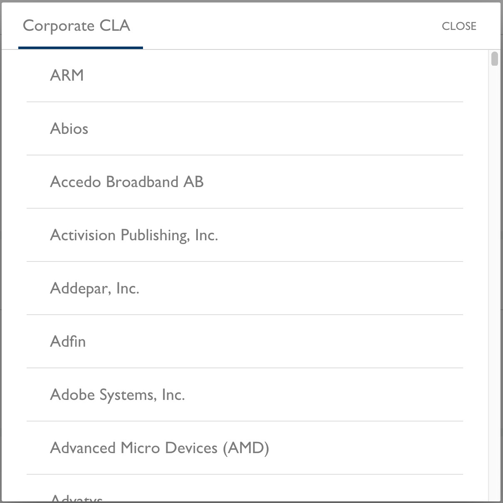

# Manage CLA Group Details
As a project manager, you use the CLA Management Console to manage your CLA group details, and view user signatures and companies.

**Do these steps:**

1. [Sign in](sign-in-to-the-cla-management-console.md).

1. Click a **project** of interest.

   The project page appears.

1. Do any of the following actions:

     * [Change Your Current CLA Type Selections](#change-your-current-cla-type-selections)

     * [View CLA User Signatures](#view-cla-user-signatures)

     * [View the Corporate CLA Companies](#view-the-corporate-cla-companies)

## Change Your Current CLA Type Selections
You can change your CLA type selections if needed.

**Do these steps:**

1. Click the **gear icon**  next to the CLA group name.

   The CLA Group dialog appears and shows your current CLA type selections.

   

1. Change the CLA Group Name, selections, or all, and click **SAVE**.

## View CLA User Signatures

You can view the full set of signatures and whitelisted contributors who are interacting with a project. A signature list shows details about who signed a CLA for your project. 

**Do these steps:**

1. Click **VIEW SIGNATURES**.

   Details for all user signatures appear:

   * **Type** shows Company, Individual, or Employee depending on the CLA type that the user signed.

   * **Name** identifies the individual or employee who signed the CLA.

   * **Company** identifies the company that is associated with a Corporate CLA.

   * **GitHub ID** shows the GitHub identity of the individual or employee.

   * **LFID** shows the Linux Foundation identity of the individual or employee.

   * **Version** identifies the version of the CLA.

   * **Date Signed** shows the date that the individual, employee, or CLA signatory signed the CLA.

   

1. (Optional) Click a column header to sort the column values in ascending or descending order. Use the pagination options to go to subsequent or previous pages.

1. Click **CLOSE**.

## View the Corporate CLA Companies

The Corporate CLA list lets you see what companies in your project have a signed Corporate CLA.

**Do these steps:**

1. Click **VIEW COMPANIES** on a Corporate CLA.

   All companies that have signed the Corporate CLA are listed.

   

1. Click **CLOSE**.