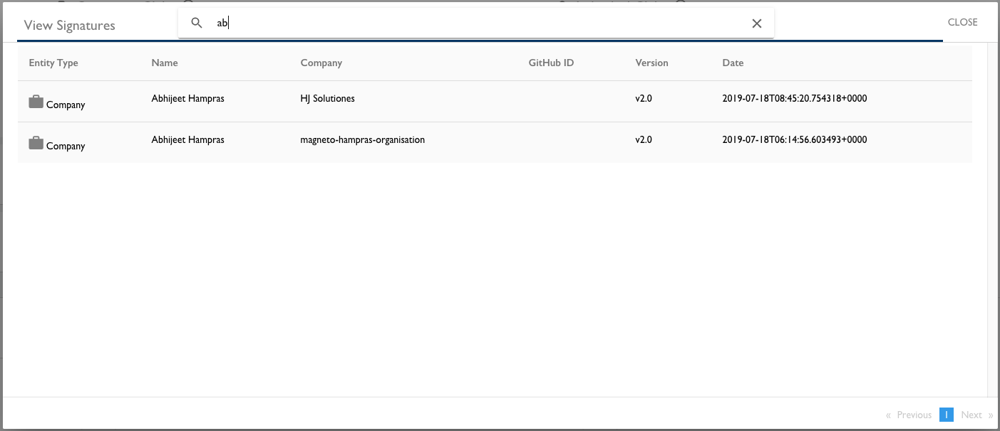

# Manage CLA Group Details
As a project manager, you use the CLA Management Console to manage your CLA group details, and view user signatures and companies.

**Do these steps**:

1. [Sign in](Sign-In-to-the-CLA-Management-Console.md).

1. Click a **project** of interest.

   The project page appears.

1. Do any of the following actions:

     * [Change Your Current CLA Type Selections](#change-your-current-cla-type-selections)

     * [View CLA User Signatures](#view-cla-user-signatures)

     * [View the Corporate CLA Companies](#view-the-corporate-cla-companies)

## Change Your Current CLA Type Selections
You can change your CLA type selections if needed.

**Do these steps:**

1. Click the **gear icon**  next to the CLA group name.

   The CLA Group dialog appears and shows your current CLA type selections.

   

1. Change the CLA Group Name, selections, or all, and click **SAVE**.

## View CLA User Signatures

A signature list shows details about who signed a CLA for your project.

**Do these steps:**

1. Click **VIEW SIGNATURES**.

   Details for all user signatures appear. Entity Type shows Company, Individual, or Employee depending on the CLA type that the user signed.

   

1. (Optional) Enter a **name** in the Search field to find a specific signature. As you type, matching entries appear. Use the pagination options to go to the next or previous pages.

1. Click **CLOSE**.

## View the Corporate CLA Companies
The Corporate CLA list lets you see what companies in your project have a signed Corporate CLA.

**Do these steps:**

1. Click **VIEW COMPANIES** on a Corporate CLA.

   All companies that have signed the Corporate CLA are listed.

   

1. Click **CLOSE**.