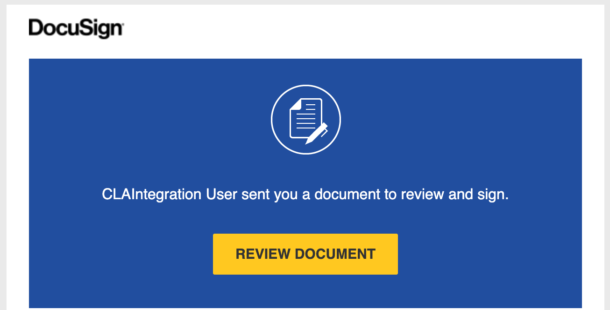

# Review and Sign a Corporate CLA by Request

As a CLA signatory, you may receive email requests to review and sign a Corporate CLA.

**Do these steps**:

1. Look in your email inbox for a CLA Sign Request email and open the email.

2. Click **REVIEW DOCUMENT** in the email.

   

   The Corporate CLA dialog opens.

3. Click **OPEN CLA** and then follow the instructions that DocuSign presents. Some fields are pre-populated such as the company name and email.

After the Corporate CLA is signed, the Company page shows the signed Corporate CLA under Signed Project CCLAs. You receive a CLA Signed Document email with an attached document PDF. Contributors to the company project simply need to confirm their association to the company, and then they can continue with their pull requests. Their subsequent contributions will not require association confirmations.

*A Corporate CLA that is signed by the CLA signatory remains in effect even when that CLA signatory is no longer employed at a company.*