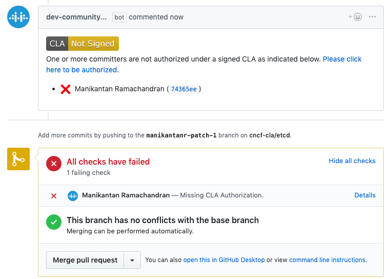
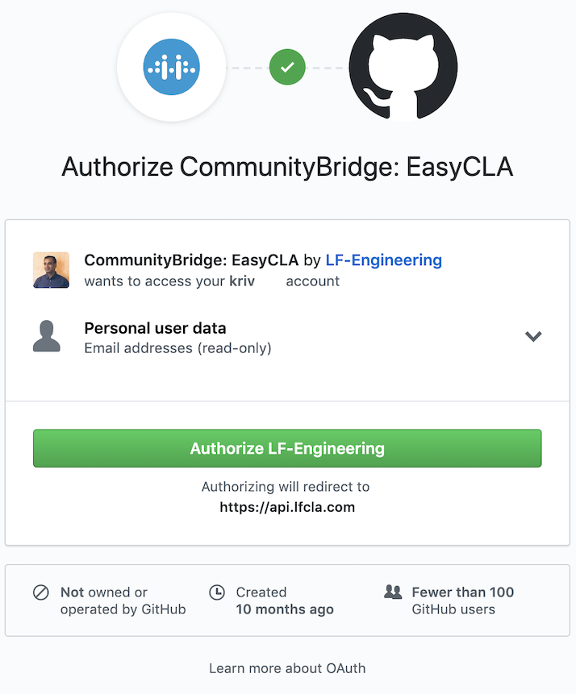

# Sign a CLA as an Individual Contributor to GitHub
As an individual contributor to an open-source project who is contributing code on your own behalf (and not on behalf of an employer), you create a pull request in GitHub to inform code maintainers about changes made to the code. During the pull request process, your CLA is verified. Also during the process, you click a link to open the CLA Contributor Console to sign the CLA.

**Do these steps:**

1. In GitHub, go to the repository that is linked to the project for your organization.

1. Make a change and send a pull request.

   EasyCLA checks the CLA status of all committers involved in that pull request. EasyCLA marks a cross or a tick beside contributor names who are involved in that pull request based on their CLA status.

   A cross next to your contributor name means the CLA check failed.

   

1. Click **Please click here to be authorized**.

   The Authorize CommunityBridge: EasyCLA dialog appears.

1. Click **Authorize LF-Engineering**. (Subsequent contributions will not require authorization.)

   

   The CLA Contributor Console appears and shows the CLA group for your project. The CLA types display:

   

1. Click **Individual** and then click **OPEN ICLA AGREEMENT**.

   DocuSign presents the agreement that you must sign. The ICLA is not tied to any employer you may have, so enter your @personal address in the E-Mail field.

   

1. Follow the instructions in the DocuSign document, sign it, and click **FINISH**.

   You are redirected to GitHub. Wait a few seconds for the CLA status to update.

   A tick appears next to your branch.

   

1. Click **Merge pull request** and confirm the merge.

   The CLA is added to the project.