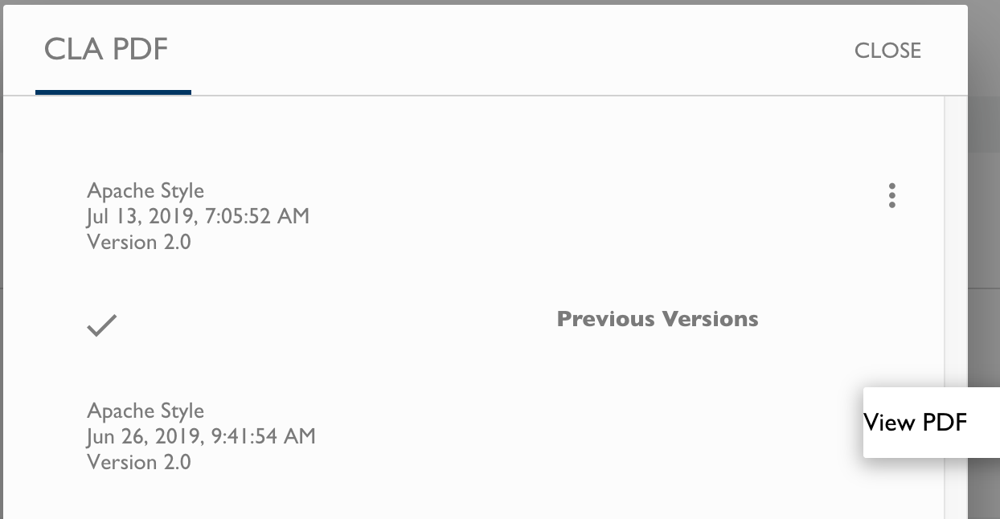

# View Current and Previous CLA PDFs
The CLA Management Console lets you select and view the current CLA PDF and previous CLA PDFs for your project.

**Do these steps**:

1. Sign in.

2. Click a **project** of interest.

   The project page appears.
3. Go to the CLA group that has the CLA PDF that you want to view.

4. Click the **clock icon** .

   The CLA PDF dialog appears and shows the current CLA PDF and previous CLA PDFs.

    

5. Click the **three-dot icon**  next to the version that you want to view.

6. Click **View PDF**.

   The PDF opens in a new window.