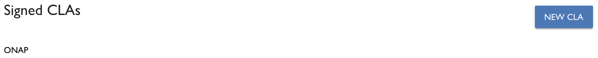

# View Employee Acknowledgements
CCLA managers can view a list of employee acknowledgements. 

**Do these steps:**

1. [Sign in](sign-in-to-the-cla-corporate-console.md).

   The CLA Corporate Console appears and shows Companies.

1. Click a **company** of interest.

   The CLA Corporate Console shows Signed CLAs.

   

1. Click a **CLA**.

   Project Signatures lists the CCLA Managers and the signed Employee Acknowledgements for the project. Each acknowledgement shows the employee name, the agreement name, and the date the employee acknowledged the agreement.