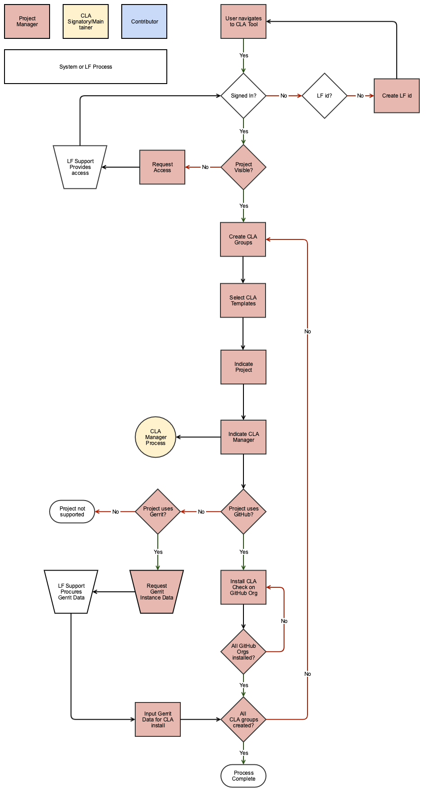
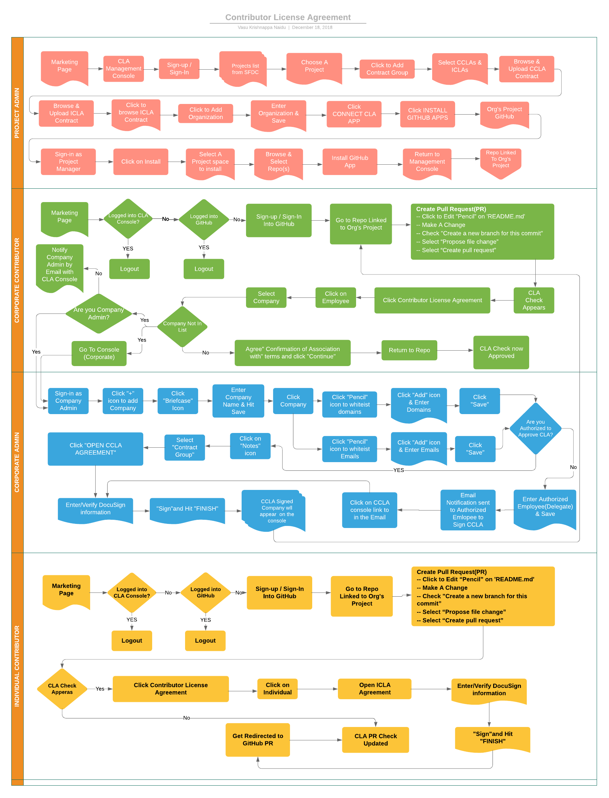

# CLA Architecture and User Flows

The following diagrams illustrate the various user flows.

## Project Manager User Flow

## Contributor User Flow

## CCLA Signatory User Flow

## CLA Flow Overview

