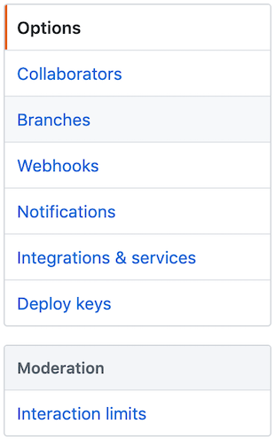
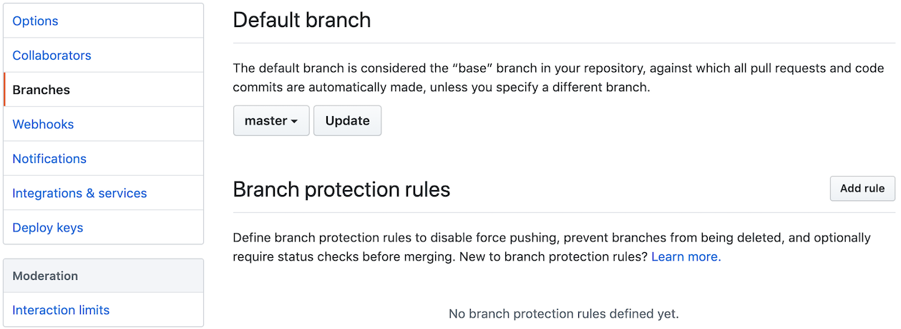
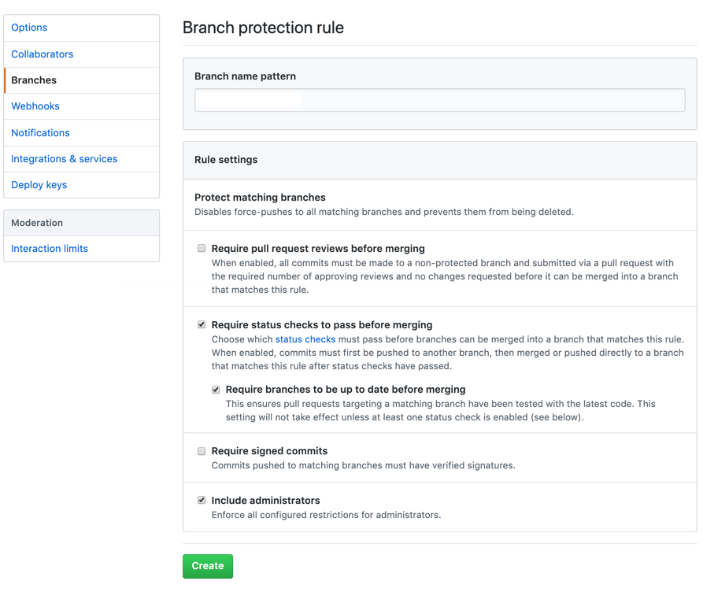

# CLA Troubleshooting
Troubleshooting helps you solve problematic symptoms in your CLA implementation.

If you are having issues with EasyCLA, go to: <https://support.linuxfoundation.org> and file a ticket.

## CLA Management Console Data Does Not Load

The CLA Management Console data may not load due to a bug in the Auth0 implementation.

**Solution:**

1. Open a Chrome window, and then type `command + option + i`.

   The Chrome developer panel appears.

1. Select the **Application** tab.

1. Select **Clear storage** under Application in the left pane.

1. Select **Clear site data** from the bottom of the developer console.

1. Sign out of the CLA Management Console.

1. Sign back in.

If the issue persists, try using an incognito browser window.

## CCLA Manager Does Not Receive Email Notifications

The CCLA manager does not receive email notifications.

**Solution:**

Go to GitHub and make sure your company has an email address.

## EasyCLA is Disabled
EasyCLA is disabled so the organizations that I want EasyCLA to monitor are not monitored.

**Solution:**

This is a known issue. GitHub is set up to permit administrators and organization owners to have maximum flexibility, which includes disabling apps like EasyCLA. Do the following steps to mitigate this problem immediately. Be sure to educate your administrators and organization owners about this GitHub setup and solution.

**Do these steps:**

1. As the GitHub organization owner or administrator, go to the GitHub repository that you want EasyCLA to monitor.

1. Click **Settings** from the top menu.

   

   Settings appear with Options in the left pane.

1. Click **Branches** under Options.

   

   Branch settings appear.

1. Select **master** for the Default branch. **Edit** or **Add rule** for Branch protection rules of your organization.

   

   Branch protection rule settings appear.

1. Select the following checkboxes in Rule settings and click **Create**.

   * Require status checks to pass before merging

   * Require branches to be up to date before merging

   * Include administrators

   