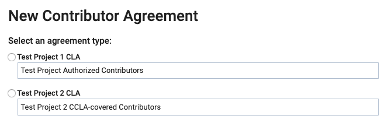

# Contribute to a Gerrit Project

As an individual contributor or a corporate \(employee\) contributor or to an open source project, you submit changed code in Gerrit to inform reviewers about the changes:

* As an individual contributor to an open-source project who is not associated to a company, you submit code in Gerrit and during the process, your CLA is verified. Also during the process, you click a link to open the CLA Contributor Console to sign the CLA Agreement. As an individual contributor, your work is owned by yourself \(Individual CLA\).
* If any of your contributions to the project are created as part of your employment, the work may not belong to you—it may be owned by your employer. In that case, the CCLA signatory represents the employer \(company\) for legal reasons, and signs the Corporate Contributor Licensing Agreement in order for your contribution to be accepted into the company. During the code submission process, your CLA status is verified.

  When all CLA management set-up tasks are complete and your CCLA signatory has signed a Corporate CLA, you simply confirm your association to the company during your first code submission. Then, you can continue. Your subsequent contributions will not require association confirmations.

**Do these steps:**

_If you are a project manager, make sure that you are logged out of the CLA Management Console before you begin._

1. In Gerrit, clone a repository under the Gerrit instance into your local machine.
2. Make a change and push the code to your Gerrit repository.

   A warning link that you need to sign a CLA appears:

   

3. Go to the URL in the message [https://,gerrit.linuxfoundation.org/infra/settings/\#Agreements](https://,gerrit.linuxfoundation.org/infra/settings/#Agreements) or navigate to **Settings** and click **Agreements**:

   

4. Click the **agreement link** that appears:

   

   New Contributor Agreement types appear:

   

5. Continue to contribute as an individual or employee \(corporate contributor\):
   * [Individual Contributor](contribute-to-a-gerrit-project.md#individual-contributor)
   * [Corporate Contributor](contribute-to-a-gerrit-project.md#corporate-contributor)

## Individual Contributor

EasyCLA presents a review agreement link to individual contributors to open a CLA and sign it.

1. Select an individual CLA type.

   

2. Click the **Please review the agreement link** and then click the message link that appears:

   

3. Log in to EasyCLA if you are prompted.
4. Click **OPEN CLA** on the dialog that appears:

   

   DocuSign presents the agreement that you must sign. The Individual CLA is not tied to any employer you may have, so enter your @personal address in the E-Mail field.

5. Follow the instructions in the DocuSign document, sign it, and click **FINISH**.

You are redirected to Gerrit. Wait a few seconds for the CLA status to update.

## Corporate Contributor

EasyCLA presents a field where you confirm your association to the company.

1. Select the Corporate CLA that you want to sign.

   An agreement field appears:

   

2. Enter **I Agree** in the field and click **SUBMIT**.
3. Read the Confirmation of Association statement and mark the agreement checkbox.

   

4. Click **CONTINUE**.

   A dialog appears and informs you: You are done!

5. Click **RETURN TO REPO**.

   You are redirected to Gerrit. Wait a few seconds for the CLA status to update or refresh the page.

   * If you are not associated with a company, click your company name and skip to Step 7 below.
   * If your company is not associated with a company in the list, continue with the next step.

6. Click **COMPANY NOT IN LIST? CLICK HERE**.

   A Corporate CLA form appears. Some fields are pre-populated such as the company name and email. Fill out the remaining form fields to contact your CCLA manager to request association to the company. The CCLA manager adds you to the whitelist.

   A Confirmation of Association with statement appears. Read the Confirmation of Association statement and mark the agreement checkbox.

7. Click **CONTINUE**.

   A dialog appears and informs you: You are done!

8. Click **RETURN TO REPO**.

   You are redirected to Gerrit. Wait a few seconds for the CLA status to update.

You have finished signing your CLA for this Gerrit instance. You are able to submit your changes to any repository under this Gerrit instance.

