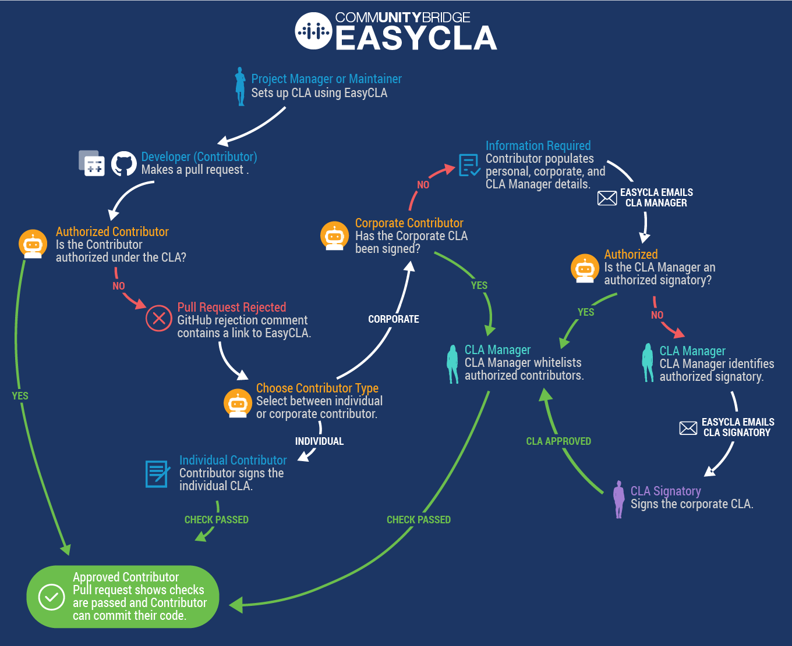

# Get Started With EasyCLA
## What is EasyCLA?
_EasyCLA_ helps maintainers of open source projects streamline their workflows and reduce the hassle of managing Contributor License Agreements (CLAs) and authorizing contributors. By automating many of the manual processes, this open source solution hosted by the Linux Foundation reduces delays for developers to get authorized under a CLA.

## What is a CLA?
A _Contributor License Agreement_ (CLA) defines the terms under which intellectual property (IP) is contributed to a company or project. Typically, the intellectual property is software under an open source license. EasyCLA guards a project's outputs so that the necessary ownership or grant of rights over all contributions is distributed under the chosen license. A contract defines the legal status of the contributed code in two types of CLAs:

* **Corporate Contributor License Agreement**

   If the company (employer) owns the contribution, a CLA signatory signs a Corporate CLA. The Corporate CLA legally binds the corporation, so the agreement must be signed by a person with authority to enter into legal contracts on behalf of the corporation. A Corporate CLA may not remove the need for every employee (developer) to sign their own Individual CLA, which covers both contributions which are owned and those that are not owned by the corporation signing the Corporate CLA.

* **Individual Contributor License Agreement**

   If as an individual you own the contribution, you sign the Individual CLA. A signed Individual CLA may be required before an individual is given commit rights to a CLA-defined project. 

## How Does it Work?
This high-level diagram shows the different flows and roles that EasyCLA supports:

	

## What Role are You?
How you interact with EasyCLA depends on your role. EasyCLA supports the following roles in its workflow:

#### Project Manager
You are a _project manager_ if you are the project maintainer who 
has responsibilities such as managing a project’s GitHub organization or Gerrit instance, members, repositories, and legal aspects like the CLA.

With EasyCLA, you do the following CLA set-up tasks:

1. [Install the EasyCLA Application](Install-the-EasyCLA-Application.md).

2. [Add a CLA Group](Add-a-CLA-Group.md).

3. [Add Contributor License Agreements](Add-Contributor-License-Agreements.md).

4. Add [GitHub repositories](Add-GitHub-Repositories-to-CLA-Monitoring-or-Remove-Them-From-CLA-Monitoring.md) or [Gerrit instances](Add-Gerrit-Instances-to-CLA-Monitoring-or-Delete-Them-From-CLA-Monitoring.md) to enforce CLA monitoring.

At any time, you can change the settings to manage your project CLA monitoring, and do other management tasks:

* [View Current and Previous CLA PDFs](View-Current-and-Previous-CLA-PDFs.md)

* [Manage CLA Group Details](Manage-CLA-Group-Details.md)

#### Contributor
You are a _contributor_ (developer) if you contribute code to GitHub or Gerrit projects. With EasyCLA, you comply to your legal obligations as a company or individual contributor:

* **GitHub company** contributor: [confirm your association with a company](Contribute-to-a-GitHub-Company-Project.md) that has a signed Corporate Contributor License Agreement.

* **GitHub individual** contributor: [sign an Individual Contributor License Agreement](Sign-a-CLA-as-an-Individual-Contributor-to-GitHub.md).

* **Gerrit company** contributor: [confirm your association with a company](Contribute-to-a-Gerrit-Project.md) that has a signed Corporate Contributor License Agreement.

* **Gerrit individual** contributor: [sign an Individual Contributor License Agreement](Contribute-to-a-Gerrit-Project.md).

#### CLA Manager
You are a _CLA manager_ if you are the person authorized to manage who can contribute under your company’s Corporate CLA. With this responsibility, you use EasyCLA to:

* [Add companies to a project](Add-a-Company-to-a-Project.md).

* [Whitelist contributors](Whitelist-Contributors.md).

#### CLA Signatory
You are a _CLA signatory_ if you are the authorized signatory of the project’s CLA for the company. Typically a CLA signatory is someone within the counsel’s office of the company. With EasyCLA, you:

* [Sign a Corporate CLA on behalf of the company](Sign-a-Corporate-CLA-on-Behalf-of-the-Company.md)—as a signatory you have legal authority to sign documents on behalf of the company.

* [Review and sign a Corporate CLA by request](Review-and-Sign-a-Corporate-CLA-by-Request.md).