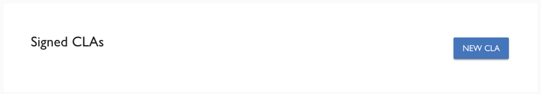
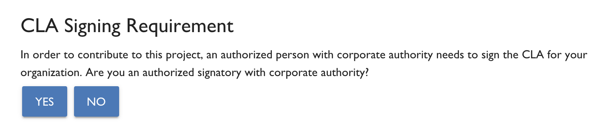
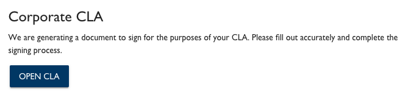
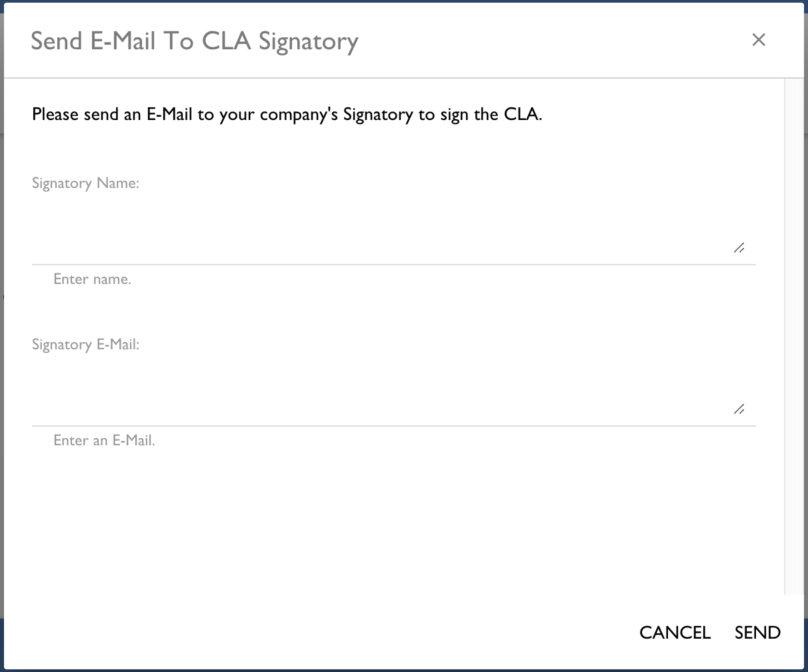

# Sign a Corporate CLA on Behalf of the Company
As a CCLA signatory, you need to have the authority within your company to sign a Corporate CLA on its behalf. If you are a CCLA manager but not a CCLA signatory, you can request that the CCLA signatory sign the Corporate CLA.

**Do these steps:**

1. [Sign in](sign-in-to-the-cla-corporate-console.md).

   The CLA Corporate Console appears and shows Companies.

1. Click the company for which you want to sign a Corporate CLA.

1. Click **NEW CLA**.

   

   The Select a Project to Sign a CCLA dialog appears and lists CLA groups.

   

1. Select the CLA group of interest.

   A CLA Signing Requirement dialog appears:

   

1. Click **YES** or **NO** according to your permissions:

    + [YES](#yes)

    + [NO](#no)

### YES

The Corporate CLA dialog opens.

      

1. Click **OPEN CLA**.

1. Follow the instructions that DocuSign presents. Some fields are pre-populated such as the company name and email.

### NO

The Send E-Mail To CLA Signatory form opens. The Signatory Name and Signatory E-Mail fields may be pre-populated; if not complete the fields. Click **SEND**.

[The CCLA signatory receives a CLA Sign Request](review-and-sign-a-corporate-cla-by-request.md) email and reviews and signs the document.

After the Corporate CLA is signed, the Company page shows the signed Corporate CLA under Signed Project CCLAs. You receive a CLA Signed Document email with an attached document PDF. Contributors to the company project simply need to confirm their association to the company, and then they can continue with their pull requests. Their subsequent contributions will not require association confirmations.

_A Corporate CLA that is signed by the CCLA signatory remains in effect even when that CCLA signatory is no longer employed at a company._