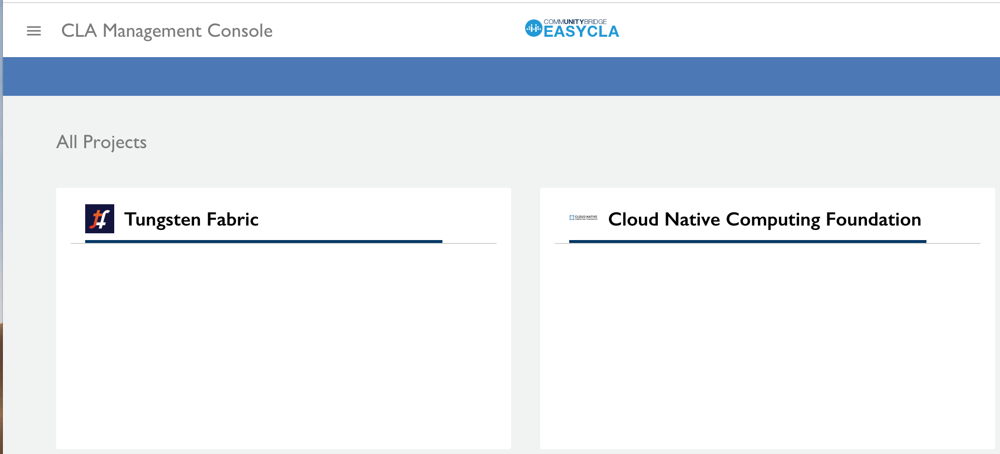

# Sign In to the CLA Management Console

Project managers sign in to the CLA Management Console to perform the CLA set-up and management tasks.

This is a new sentence.

**Do these steps:**

1. Go to [https://project.lfcla.com](https://project.lfcla.com).
2. Click **SIGN IN**.

   The LF CLA sign-in dialog appears.

3. This is another sentence for test.
4. Enter your credentials as the project manager and click **LOG IN**.

   The CLA Management Console appears and lists your assigned projects from the Linux Foundation, for example:

   

5. Click a **project name** of interest.

   For each project, the CLA Management Console provides the following information:

   * **GitHub Organizations** shows the organizations to which you have connected to the CLA Management Console. Organizations are shared accounts where companies and open source projects can collaborate across many projects at once.
   * **CLA Groups** shows the CLA groups that you have added to the project. A CLA group defines one or more CLA types that contributors must sign.
     * **GitHub Repositories** shows the repositories that you have configured to require CLA monitoring for pull requests.
     * **Gerrit Instances** shows the Gerrit instances that you have added to require CLA monitoring for pushes.

