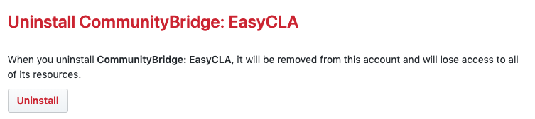

# Uninstall the EasyCLA Application
As a project manager, you can uninstall the EasyCLA Application. When you uninstall the app, it is removed from all your repositories. CLA monitoring is no longer in effect.

_A problem occurs when you install the EasyCLA Application for your organization and then delete the organization but do not uninstall the EasyCLA Application. If you attempt to add the organization and reinstall the EasyCLA Application, you cannot configure the repositories due to the existing EasyCLA Application link._

**Do these steps**:

1. In the top-right corner of GitHub, click your **profile photo**, and then select **Settings** from the drop-down list.

   Personal settings appear on the left side of the page.

1. Select **Applications** or **Organizations** in Personal settings.

   The Applications or Organizations pane appears.

1. Click **Installed GitHub Apps** tab if it does not appear by default.

1. Click **Configure** for the CommunityBridge: EasyCLA app.

   

1. Go to the Uninstall CommunityBridge: EasyCLA section and click **Uninstall**.

   

1. Refresh the CLA Management Console.

   The EasyCLA Application is uninstalled.