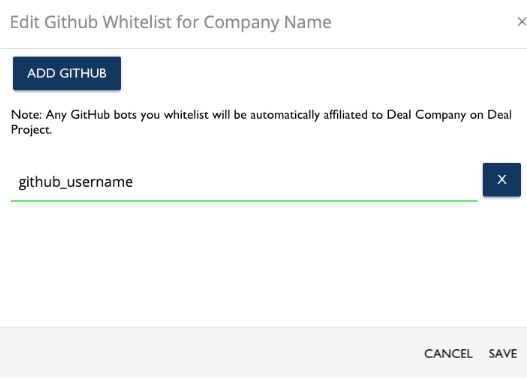

# GitHub Bot Whitelist

Each project will need to whitelist any bots that open pull requests on GitHub. To accomplish this, at least one company with a signed a Corporate CLA under the project in question will need to list the bot's GitHub Username within their GitHub Whitelist.

Once you have completed the steps to add the bot to your whitelist, the bot should appear in your Employee Acknowledgments

Refer [GitHub Bot Whitelist](../ccla-managers-and-ccla-signatories/whitelist-contributors.md#github-whitelist)

